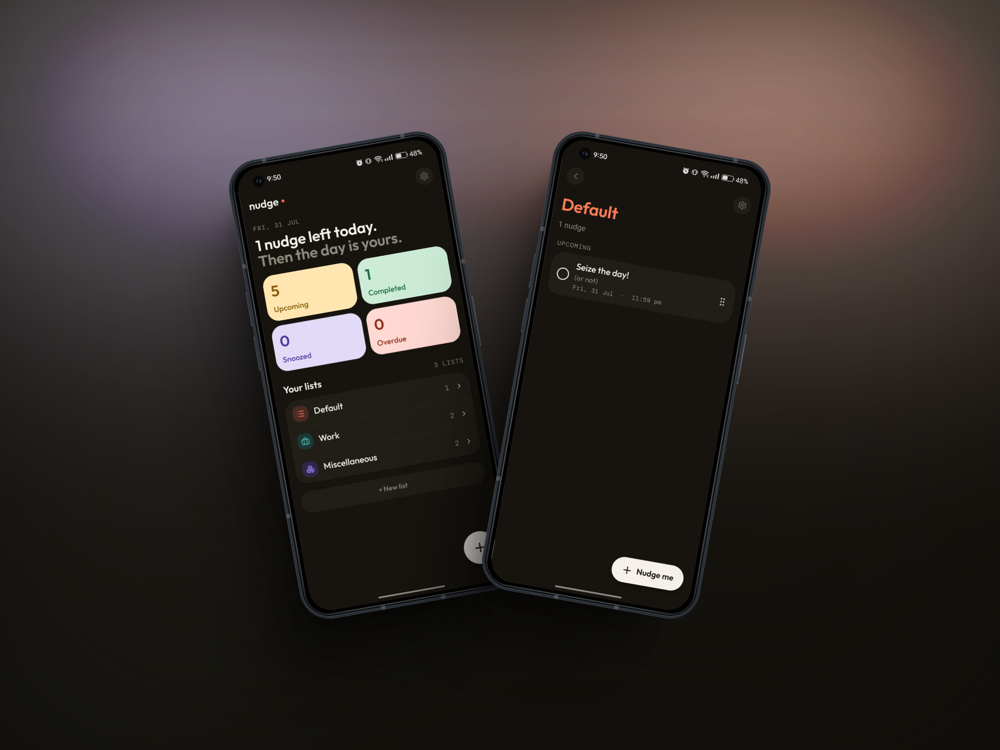
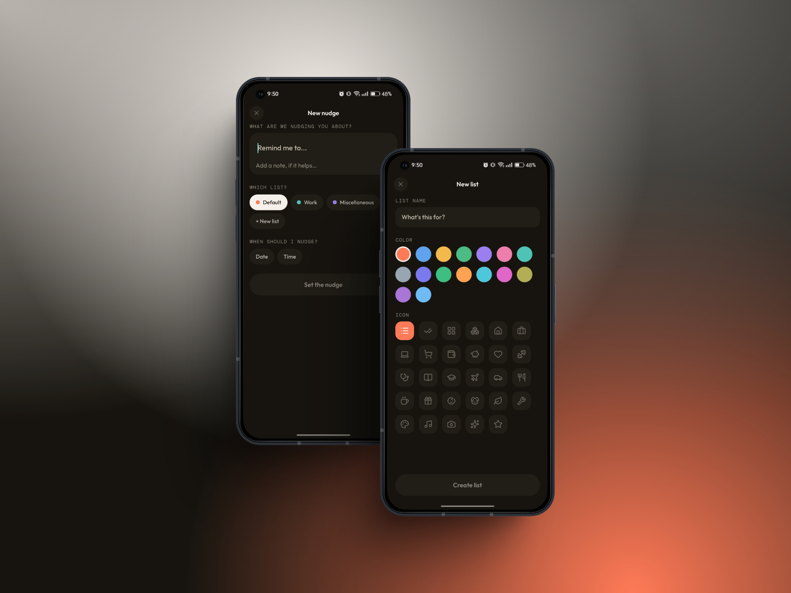

# Nudge

Nudge is a local-first reminders app for things that don't fit a calendar — recurring chores,
one-off errands, "someday" tasks. Reminders ("nudges") live in color/icon-coded lists, can repeat
on a schedule, be snoozed, and trigger local notifications. Everything is stored on-device in
SQLite, with JSON export/import for backup.

Built with [Expo](https://expo.dev) (React Native) and [Expo Router](https://docs.expo.dev/router/introduction/).

## Screenshots

<p>
  
  <br />
  <br />
  
</p>

## Stack

- Expo SDK 54 + Expo Router (file-based routing)
- `expo-sqlite` for local storage, with versioned migrations
- `zustand` for app state
- `nativewind` / Tailwind for styling
- `expo-notifications` for scheduled reminders
- A custom Android Quick Settings tile (native Kotlin `TileService`) for creating a nudge without opening the app


## Getting started

```bash
npm install
npx expo start
```

This covers most day-to-day development — open the app in [Expo Go](https://expo.dev/go), an
Android emulator, or an iOS simulator.

### Testing the Quick Settings tile (Android)

The "create nudge" Quick Settings tile ([plugins/tile-service](./plugins/tile-service)) modifies
native Android project files via a config plugin, so it isn't available in Expo Go. To test it,
build and run a development client instead:

```bash
npx expo run:android
# or, for a shareable dev build:
eas build --profile development --platform android
```

## Scripts

| Command | Description |
| --- | --- |
| `npm start` | Start the Metro bundler / Expo dev server |
| `npm run android` | Start and open on a connected Android device/emulator |
| `npm run ios` | Start and open in the iOS simulator |
| `npm run web` | Start the web build |
| `npm run lint` | Lint with `expo lint` |
| `npm test` | Run the unit test suite (Vitest) |

## Project structure

```
src/
  app/          Expo Router screens (lists, nudges, settings) — file-based routing
  components/   UI building blocks, grouped by feature (lists, reminders, ui)
  store/        zustand stores (lists, nudges, settings, app reset)
  db/           expo-sqlite access, migrations, backup import/export
  lib/          Framework-agnostic logic: recurrence rules, notifications, completion,
                backup serialization, date/status helpers
  theme/        Design tokens (colors, shadows)
  constants/    Shared static data (e.g. list icon set)
plugins/
  tile-service/ Config plugin + native source for the Android Quick Settings tile
android/        Generated native Android project (includes the tile service wiring)
```

## Data & backups

All data is stored locally in SQLite (see `src/db/migrations.ts` for schema history). Settings →
Export produces a JSON backup (`src/lib/backup.ts`, `src/db/backup.ts`); Import validates and
merges a backup file back in via `expo-document-picker`.

## Learn more

- [Expo documentation (v54)](https://docs.expo.dev/versions/v54.0.0/) — this project pins to the
  v54 docs; check AGENTS.md before assuming a newer API is available.
- [Expo Router docs](https://docs.expo.dev/router/introduction/)
